# SOUL: Specific and Objective Understanding Logic

<!-- Optional Badges -->

## Overview

SOUL is a modular, extensible Python framework for developing advanced AI agents, **"Soulmades"**, characterized by **purposeful agency**, **distinct perspectives**, and the ability to act based on an internal **agenda**. It moves beyond reactive, text-wall generating models towards AI that exhibits "Specific and Objective Understanding Logic."

SOUL is designed to be **pluggable** into various host systems (chatbots, virtual environments, robotic control systems, creative tools) enabling developers to imbue their applications with AI agents possessing richer internal states and more directed, insightful behaviors.

## Core Problem Addressed

Current large language models, while powerful, often function as general-purpose text generators. They typically lack:

*   **Consistent Perspective:** Difficulty maintaining a specific viewpoint or bias across interactions.
*   **Internal Agenda:** Primarily reactive, lacking intrinsic drives or goals guiding their actions.
*   **Purposeful Interaction:** Tendency towards verbose, undifferentiated output ("text walls") rather than concise insights or targeted actions.
*   **Deep Understanding:** Reliance on surface-level "context" (recent text) rather than potentially deeper, evolving internal states or structured knowledge representations.

SOUL provides the architectural components to address these limitations, enabling the creation of AI agents that operate with more intention and understanding.

## Key Concepts

*   **SOUL (Specific and Objective Understanding Logic):** The core framework philosophy and architecture, focusing on targeted, grounded reasoning and purposeful action.
*   **Soulmade:** A micro-agent built using the SOUL framework. Each Soulmade develops its own internal state, perspective, and agenda.
*   **Purposeful Agency:** The defining characteristic of a Soulmade. Actions and outputs are driven by an internal agenda and perspective, aimed at achieving specific goals or expressing a viewpoint, rather than just responding generically. Soulmades engage when they have a "strong opinion" or insight relevant to their agenda.
*   **Internal State (Motivation Vector):** A dynamic, multi-dimensional representation of the Soulmade's current drives, biases, goals, and perspectives. This evolves based on interaction, feedback, and internal logic.
*   **Agenda:** The set of active goals or intentions derived from the Internal State that guide the Soulmade's focus and actions.
*   **Perspective/Bias:** Soulmades can be configured or learn specific viewpoints, influencing how they interpret information and formulate responses.
*   **Background Prompting:** The core mechanism used by SOUL to guide a pluggable base LLM. Targeted prompts, generated based on the Internal State and context, steer the LLM towards generating outputs aligned with the Soulmade's current agenda and perspective.
*   **Society of Minds (Collective Synergy):** SOUL enables you to spawn multiple Soulmades and leave them "on", operating together in the background. These agents synergize like voices inside a collective agent's head, each contributing their unique perspective, agenda, and expertise. Their ongoing interplay and communication result in emergent behaviors and outputs that reflect the best aspects of all, forming a dynamic, collaborative intelligence beyond any single agent.
## Architecture

SOUL employs a modular architecture centered around guiding a powerful, pre-trained LLM:

```mermaid
graph LR
    subgraph Host System
        Host["Host System/Application <br/>(Chatbot, Game, Robot)"]
    end

    subgraph External Systems
        LLM["Pluggable LLM <br/>(GPT-4o, etc.)"]
        KS["External Knowledge Source <br/>(MCG, DB, Files, API)"]
    end

    subgraph SOUL Framework Core
        direction TB

        subgraph Agent Core
            SOUL["SOUL Agent <br/>(+ SOUL Components)"]
        end

        subgraph Cognitive Components
            MF["Motivation Framework <br/>(Vector, Instincts)"]
            BPE["Background Prompting Engine <br/>(Templates, Refinement)"]
            Gov["(Governance Hooks)"]
        end

        subgraph Interfaces
            PAI["Perception/Action Interfaces"]
            KI["Knowledge Interface"]
            LLMI["LLM Interface"]
        end

        SOUL -->|Controls/Receives Internal State| MF
        SOUL -->|Controls/Initiates| BPE
        SOUL -->|Queries| KI
        SOUL -->|Checks/Controlled By| Gov

        MF --->|Guides| BPE
        BPE --->|Generates Prompt| LLMI
        KI --->|Accesses| KS
        LLMI --->|Requests| LLM
        LLM --->|Returns Response| LLMI
        LLMI --->|Provides Result/Feedback| BPE
        KS --->|Provides Data| KI
        KI --->|Provides Context| SOUL
    end

    Host <---> PAI
    PAI <---> SOUL

    style Host fill:#68a,stroke:#DDD,stroke-width:2px,color:#FFF %% White text on darker blue %%
    style External Systems fill:#eec,stroke:#333,stroke-width:2px,color:#000 %% Black text on light yellow %%
    style SOUL fill:#446,stroke:#DDD,stroke-width:2px,color:#FFF %% White text on dark blue/purple %%
    style MF fill:#558,stroke:#DDD,stroke-width:1px,color:#FFF %% White text on darker blue/purple %%
    style BPE fill:#558,stroke:#DDD,stroke-width:1px,color:#FFF %% White text on darker blue/purple %%
    style Gov fill:#666,stroke:#AAA,stroke-width:1px,stroke-dasharray: 5 5,color:#FFF %% White text on gray %%
    style PAI fill:#474,stroke:#DDD,stroke-width:1px,color:#FFF %% White text on green %%
    style KI fill:#474,stroke:#DDD,stroke-width:1px,color:#FFF %% White text on green %%
    style LLMI fill:#474,stroke:#DDD,stroke-width:1px,color:#FFF %% White text on green %%
```



**Key Components (Implemented in `src/soul/`):**

1.  **Agent Orchestrator (`agent.py`):** Manages the core perception-cognition-action loop.
2.  **Interfaces (`interfaces/`):** Abstract base classes defining how SOUL plugs into external systems (LLMs, Knowledge Sources, Host Application I/O, Governance). This ensures modularity and extensibility (e.g., for future integration with specific platforms like Hyperon/MeTTa or custom knowledge bases).
3.  **Motivation Framework (`components/motivation/`):** Manages the agent's Internal State (Motivation Vector). Includes seedable "instincts" and mechanisms for updating the vector based on inputs and feedback. Supports defining diverse motivational structures (human-like or "alien digital").
4.  **Background Prompting Engine (`components/prompting/`):** Generates targeted prompts for the backend LLM, guided by the Motivation Framework and assembled context. Includes template management and refinement logic.
5.  **Context Assembler (`components/context/`):** Gathers and structures relevant information from perception inputs, interaction history, and knowledge sources for the Prompting Engine.
6.  **Evaluation/Learning Hooks (`components/evaluation/`):** Mechanisms for tracking the effectiveness of prompts/actions and enabling adaptive refinement of the Motivation Framework and prompting strategies.
7.  **LLM Adapters (`adapters/llm/`):** Concrete implementations for interacting with specific LLMs (e.g., OpenAI, Anthropic).
8.  **(Optional) Knowledge Adapters (`adapters/knowledge/`):** Example implementations for specific knowledge sources.

## Features & Capabilities

*   **Modular Motivation Systems:** Define custom drives, goals, and biases for agents.
*   **Dynamic Agenda Formation:** Agents act based on an evolving internal state.
*   **Perspective-Driven Interaction:** Agents can maintain and express specific viewpoints.
*   **Purposeful Outputs:** Generates targeted insights or actions, minimizing generic "text walls."
*   **Pluggable LLM Backend:** Leverage various state-of-the-art language models.
*   **Extensible Interfaces:** Integrate with diverse host systems, knowledge sources, and future governance mechanisms.
*   **Adaptive Learning:** Potential for motivations and prompt strategies to evolve based on performance.

## Getting Started

<!-- Placeholder: Add standard Python setup instructions -->

```bash
# 1. Clone the repository
git clone https://github.com/your-org/soul-framework.git
cd soul-framework

# 2. Create and activate a virtual environment (recommended)
python -m venv .venv
source .venv/bin/activate  # On Windows use `.venv\Scripts\activate`

# 3. Install dependencies (using Poetry example)
pip install poetry
poetry install

# 4. Configure environment variables (e.g., LLM API Keys)
# Create a .env file or export variables:
# export OPENAI_API_KEY="your_key_here"
# export ANTHROPIC_API_KEY="your_key_here"

# 5. Run an example
python examples/simple_chatbot/main.py
```

Refer to the `examples/` directory and `docs/` for more detailed usage and integration patterns.

## Directory Structure Overview

(See detailed structure in the `soul_framework/` section above)

*   **`config/`**: Configuration files.
*   **`docs/`**: In-depth documentation.
*   **`examples/`**: Practical usage examples.
*   **`notebooks/`**: Experimental analysis.
*   **`scripts/`**: Utility scripts.
*   **`src/soul/`**: Core framework source code.
    *   **`interfaces/`**: Key pluggability points (ABCs).
    *   **`core/`**: Foundational data structures.
    *   **`components/`**: Main logic modules (Motivation, Prompting, etc.).
    *   **`adapters/`**: Concrete implementations for external systems (LLMs, etc.).
*   **`tests/`**: Automated tests.

## Development & Contribution

We welcome contributions! Please follow standard development practices:

*   Set up the development environment (install dev dependencies).
*   Run tests (`pytest`) and ensure sufficient coverage.
*   Adhere to code style (e.g., use `black`, `ruff`, `mypy`).
*   Submit Pull Requests with clear descriptions and passing checks.

<!-- Add link to CONTRIBUTING.md if available -->

## Roadmap

*   Refinement of the Motivation Framework update logic and learning mechanisms.
*   Expansion of seed instincts and background prompt templates.
*   Development of more sophisticated context assembly strategies.
*   Implementation of standard Knowledge Source adapters (e.g., vector DBs).
*   More comprehensive examples (virtual agents, robotics interface stubs).
*   Formalization of the Governance Hook interface.
*   Benchmarking and performance optimization.

## License

Distributed under the [MIT License](LICENSE).
