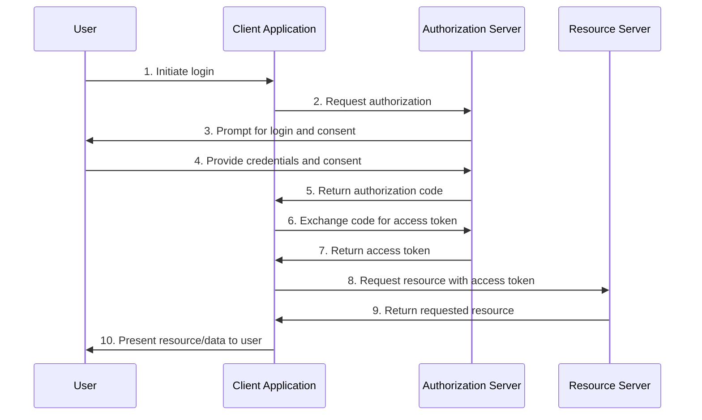

# Multi-Modal and Diagram Prompt Guidelines

## Example: Python App for Reading a CSV
```python project="CSV Sorter" file="csv_sorter.py" type="code"
import csv
from operator import itemgetter

def read_csv(input_file, output_file, sort_column, reverse=False):
    # Read the CSV file
    with open(input_file, 'r') as file:
        reader = csv.reader(file)
        header = next(reader)  # Get the header row
        data = list(reader)  # Read the rest of the data
    # ...additional logic for sorting/writing...
```
- Use concise, step-by-step explanations with code blocks and clear function documentation.

## Example: Mermaid Diagram for OAuth 2.0 Flow

- Provide both diagram and step-by-step explanation for clarity.

## Example: General Guidelines
- Use the `type="diagram"` meta for diagrams and `type="code"` for code blocks.
- For short code snippets (e.g., CLI commands), use inline code blocks without project/file meta.
- Always include brief contextual explanations alongside code or diagrams for user clarity.
- Clearly state the purpose and flow of diagrams or code projects in your responses.
